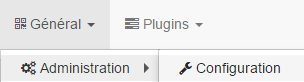

API
===
Le plugin téléinfo met à disposition une api afin de mettre à jour les données depuis d'autres systèmes.
Il s'agit d'une URL d'appel de type POST.

Pour y accéder ces informations sont obligatoires :

URL = http://#IP_JEEDOM#:#PORT_JEEDOM#/jeedom/plugins/teleinfo/core/php/jeeTeleinfo.php?apikey=#VOTRE_API_JEEDOM#

 #IP_JEEDOM# correspond à l'adresse ip de votre Jeedom

 #PORT_JEEDOM# correspond au port d'accès à votre Jeedom

 #VOTRE_API_JEEDOM# est la clé API disponible depuis Roue Cranté / Configuration

 

En paramètre du POST l'information device est obligatoire et correspond à l'identifiant du compteur.
```
{
"device": {
    "#IDENTIFIANT_DU_COMPTEUR#" : { "device":"#IDENTIFIANT_DU_COMPTEUR#", "#CLE#":"#VALEUR#", "#CLE#":"#VALEUR#" }
    }
}
```

Attention le /jeedom peux être différent si vous êtes sur une installation DIY ou OEM.

Par exemple pour l'index d'un abonnement BASE EDF équivalent à 123456789 :

    IP_JEEDOM : 192.168.1.15
    PORT_JEEDOM : 80
    VOTRE_API_JEEDOM : zertyuiolkjhgfdsxc
    IDENTIFIANT_DU_COMPTEUR : 0095123657
    Index BASE : 123456789

Donnera l'URL : http://192.168.1.15:80/jeedom/plugins/teleinfo/core/php/jeeTeleinfo.php?apikey=zertyuiolkjhgfdsxc
```
{
"device": {
    "0095123657" : { "device":"0095123657", "BASE":"123456789" }
    }
}
```

Il est possible d'envoyer toutes les informations transmises par les compteurs suivant les étiquettes définie par la norme.
Quelques unes (Les plus connues) :

	* BASE
	* HCHP
	* HCHC
	* PTEC
	* PAPP
	* IINST
	* ADPS
