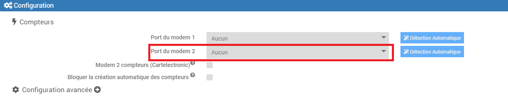

Architecture
===
Pour récupérer la Téléinformation il faut se connecter sur les bornes I1 et I2 du compteur :

## Compteur électronique

Pas de configuration spécifique pour ce type de compteur.

## Compteur Linky

Le compteur linky possède 2 modes de téléinformation 
>Pour connaitre le mode utilisé appuyer plusieurs fois sur le + de votre compteur linky jusqu'à l'affichage TIC Standard ou TIC Historique.

-    Mode historique : Ce mode assure une compatibilité égale aux compteurs d'ancienne génération.
     Pour configurer ce mode, aller dans les paramètres du plugin, cliquer sur le + (1), ne pas cocher 2 et si besoin sélectionner 1200 en 3 :

     

-    Mode standard : mode de communication plus récent, **seul ce mode requiert l'option Linky sur le plugin**.
     Pour configurer ce mode, aller dans les paramètres du plugin, cliquer sur le + (1), cocher 2 et si besoin sélectionner 9600 en 3 :
     

### Test

Cas d'utilisation de 2 compteurs
===

## Utilisation d'un second compteur
Si vous disposez de 2 compteurs chez vous, il faut le paramétrer (sauf si utilisation du modem ci dessous) :

## Utilisation du modem Cartelectronic 2 Compteurs
Dans le cas d'utilisation du modem Cartelectronic 2 Compteurs et le branchement de 2 compteurs électrique il est nécessaire d'activer le mode 2 compteurs.

