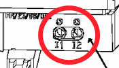
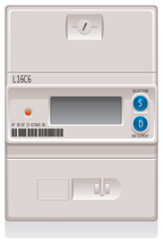
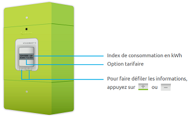
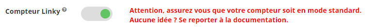
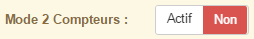
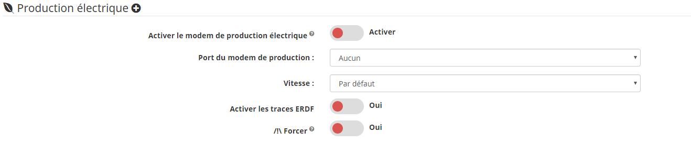

Architecture
===
Pour récupérer la Téléinformation il faut se connecter sur les bornes I1 et I2 du compteur :

## Compteur électronique

Pas de configuration spécifique pour ce type de compteur.

## Compteur Linky

Le compteur linky possède 2 modes de téléinformation.
-    Le premier appelé historique : Ce mode assure une compatibilité égale aux compteurs d'ancienne génération.
     La configuration doit donc être sur :

     

-    Le second appelé stantard : **Seul ce mode requiert l'option Linky sur le plugin**, il s'agit du nouveau mode de communication.
     La configuration doit donc être sur :
     

>Pour connaitre le mode utilisé par le compteur appuyer plusieurs fois sur + jusqu'à l'affichage TIC Stantard ou TIC Historique.

Cas d'utilisation de 2 compteurs
===

## Utilisation du modem Cartelectronic 2 Compteurs
Dans le cas d'utilisation du modem Cartelectronic 2 Compteurs et le branchement de 2 compteurs électrique il est nécessaire d'activer le mode 2 compteurs.

## Utilisation d'un second compteur pour de la production électrique
Dans ce cas il faut activer le mode production du plugin :

