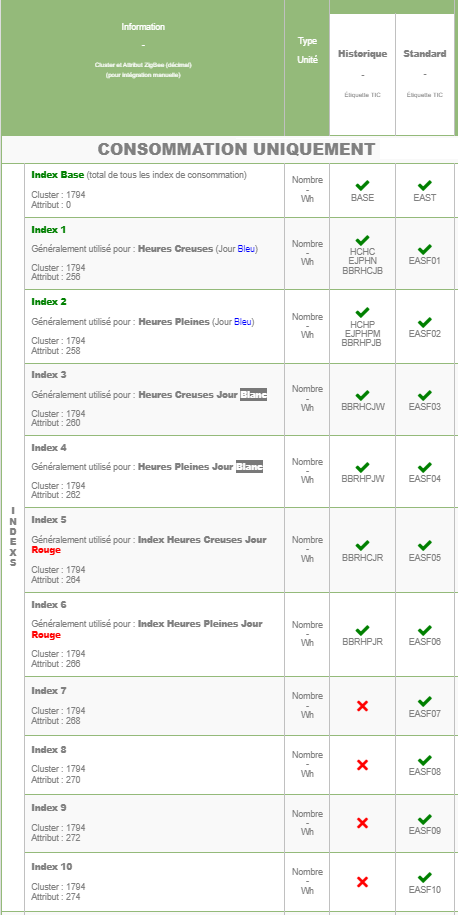
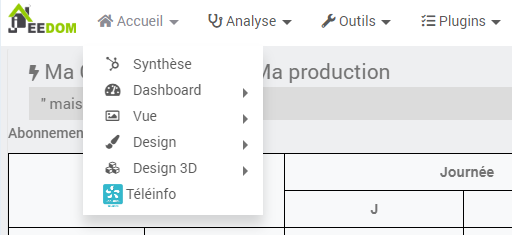
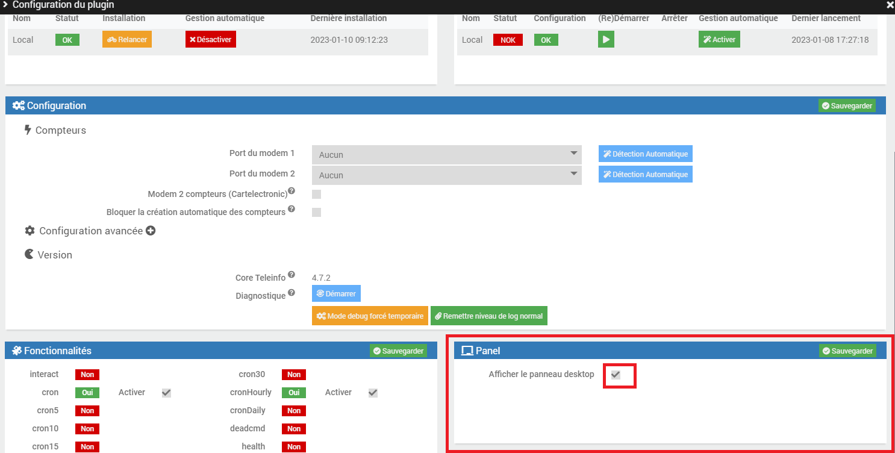

Les commandes
===

Les commandes (Ajouter une donnée) correspondent aux données envoyées par la téléinformation via le modem à Jeedom.

Celles-ci dépendent du mode de fonctionnement de votre compteur.

Pour le mode historique :
-   Index (Base / Heures Pleines / Heures Creuses)
-   Index (Heures Normales / Heures de pointe mobile / Heures Pleines Bleu / Heures Creuses Bleu / Heures Pleine Blanc / Heures Creuses Blanc / Heures Pleines Rouge / Heures Creuses Rouge)
-   Tranche tarifaire
-   Type d'abonnement
-   Puissance instantanée
-   Intensité instantanée (Pour triphasé également)
-   Alerte dépassement (Pour triphasé également)
-   Intensité souscrite
-   Préavis EJP (30 minutes avant)
-   Couleur EJP lendemain.

Pour le mode Standard les principaux index sont:
- EAST: équivaut à 'BASE' dans le mode historique
- EASF01 à EASF10: index utilisés pour répartir les différents tarifs horaires, leur utilisation dépend de l'abonnement souscrit
- EAIT: puissance envoyée vers le réseau si vous êtes producteur

> résumé et comparaison entre les deux modes:

>  

> Pour consulter la liste complète: [Enedis-NOI-CPT_54E.pdf](../images/Enedis-NOI-CPT_54E.pdf)

Les statistiques
===

Afin d'obtenir des informations sur une durée plus longue des statistiques ont étés ajoutées.
Ces statistiques correspondent aux informations suivantes :
-   Consommation du jour en cours
-   Consommation d'hier
-   Puissance apparente : Certains compteurs ne renvoie pas l'information PAPP. Pour cela un calcul à été implémenté afin d'obtenir une moyenne de consommation en W toutes les minutes.

De plus certaines statistiques (consommation du mois, de l'année en cours, ...) sont affichées sur le panel

  
  
  
Le panel doit être validé dans la configuration du plugin

  
  

Les unités
===

-   Les index : Watt-heure
-   Tranche tarifaire : Chaîne de caractères.
-   Puissance apparente instantanée : Volt-Ampère.
-   Les intensités : Ampère.
-   Les alertes dépassement : Ampère
-   Type d'abonnement : Chaîne de caractères.
-   Le préavis EJP et la couleur du lendemain : Chaîne de caractères.
-   La conso moyenne sur la dernière minute : Watt