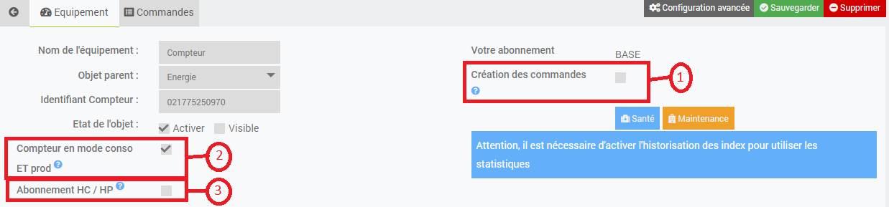

Configuration
===

Par défaut le plugin offre la possibilité de créer automatiquement les compteurs associés aux commandes réceptionnées. Il permet aussi de définir certains paramètres. 

Pour cela démarrez le daemon, attendez que les premières trames arrivent puis rendez vous sur Plugin / Protocoles Domotiques / Téléinfo.
Vous devriez voir apparaitre un objet avec un ID.

Cliquez sur l'objet puis

Repère 1: cochez si vous voulez une création automatique des commandes, 

Repère 2: cochez si vous avez un Linky unique qui fonctionne en mode consommateur ET producteur,

Repère 3: cochez si votre abonnement est Heure creuse / heure pleine ou Tempo ou EJP. Les différents abonnements seront traités dans une future mise à jour.

enfin sauvegardez. A partir de ce moment toutes les commandes reçues et non reconnues seront ajoutées automatiquement et l'affichage du panel sera adapté à votre configuration.

Vous pouvez également créer votre appareil manuellement :
-   Créez votre nouvel appareil en cliquant sur Ajouter
-   Ajoutez les commandes que vous souhaitez récupérer en cliquant sur le bouton vert "Commande"
-   Vous pouvez également afficher des statistiques de consommation (Aujourd'hui / Hier / Mois en cours / Mois dernier) en cliquant sur le bouton "Ajouter une statistique"
-   Renseignez le nom affiché dans Jeedom, le Sous-Type en fonction de l'information qui sera récupérée, la donnée à récupérer et enfin les paramètres associés.
-   Cliquez sur sauvegarder.

>Il est possible de désactiver la création automatique des nouveaux compteurs:
>
>

>Il est possible aussi de désactiver la création automatique des nouvelles commandes en décochant:
>
>
