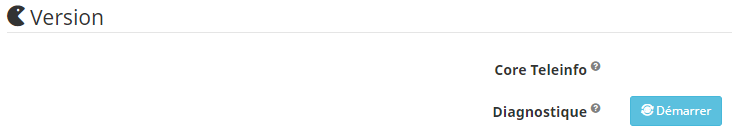
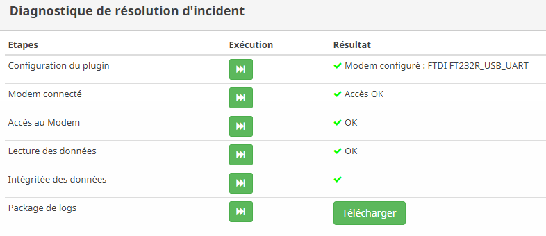

Diagnostic
===
Il est possible de lancer un diagnostique sur le plugin afin de tenter de détecter les problèmes.
Pour cela un bouton est mis à disposition sur la page configuration du plugin

La page de diagnostique propose plusieurs étapes à réaliser dans l'ordre.
Des conseils sont disponibles afin d'aider à la résolution.
Il est également possible de générer une archive contenant les infornations nécessaires à l'ouverture d'un ticket.

