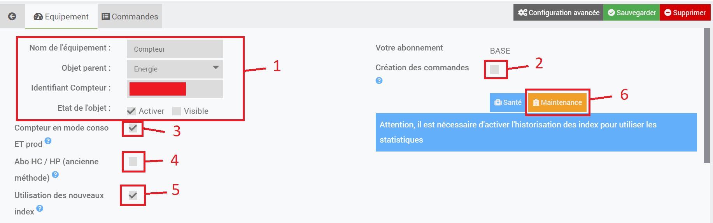
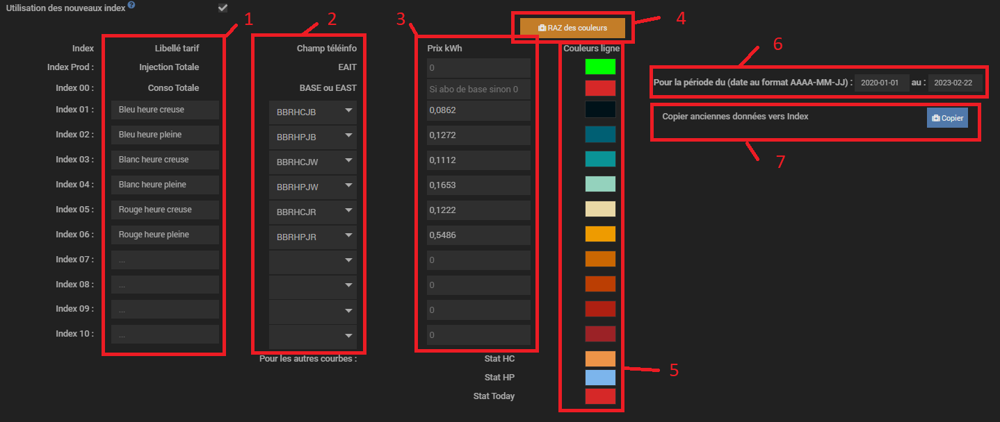
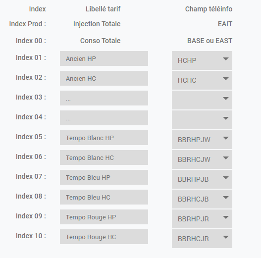
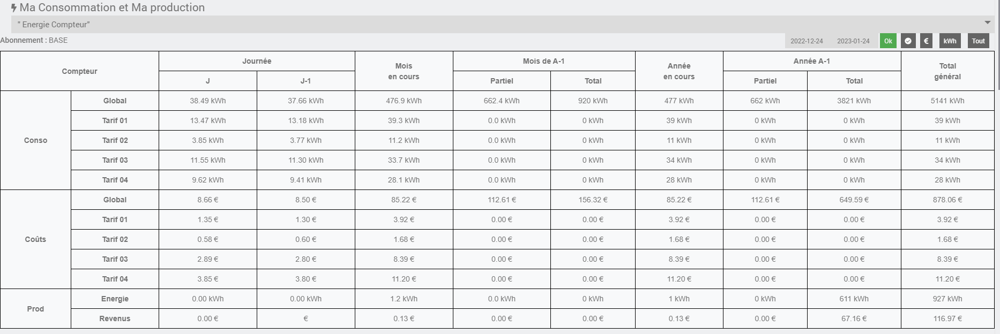
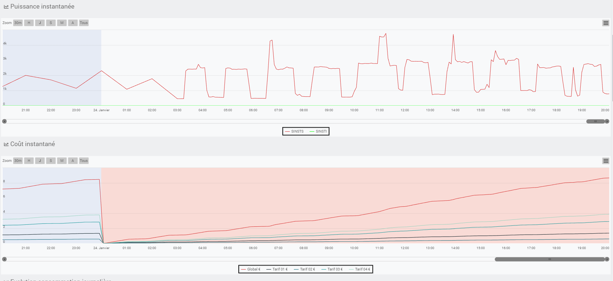
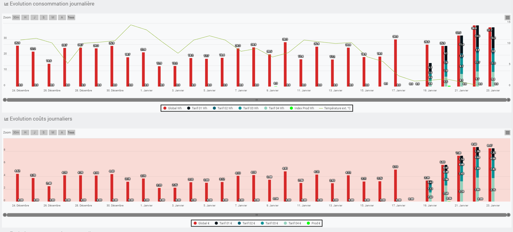
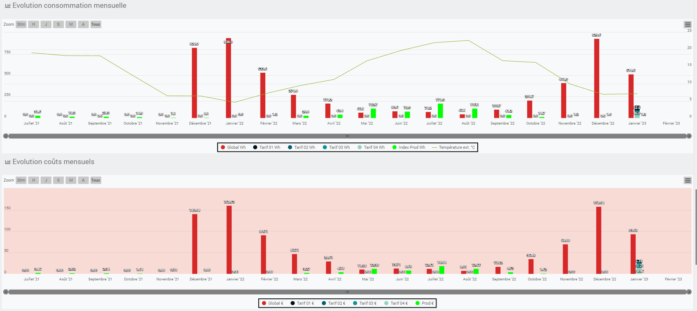
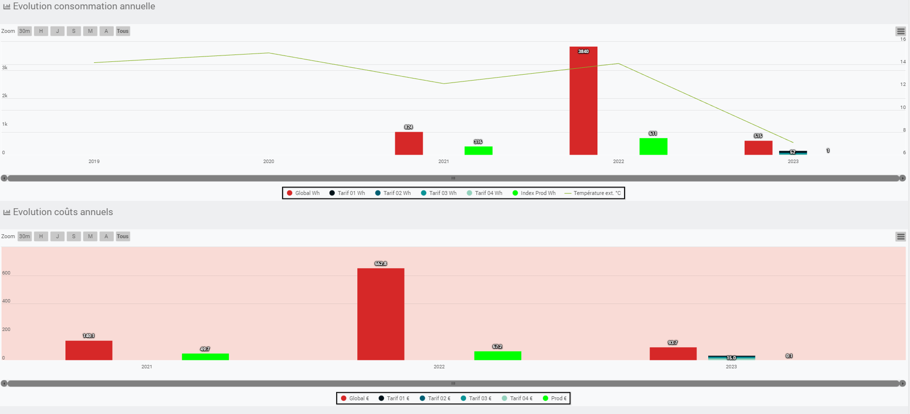

<br><br><br>

Présentation
===
Le plugin Téléinformation permet de récupérer les informations de votre compteur EDF et/ou d'un Broker MQTT (nouveauté) et construire des statistiques de consommation et production.

**Attention**: à partir de la **version 4.7.3** du plugin il y a une nouvelle gestion des index (l'ancienne avec seulement BASE, HP et HC reste opérationnelle).

# Mise en évidence des nouveautés en suivant ce lien : [explications](/plugin-teleinfo/fr_FR/news/)


<br><br><br><br><br><br><br><br><br><br>


Architecture
===
Pour récupérer la Téléinformation il faut se connecter sur les bornes I1 et I2 du compteur :


<br>
<br>

## Compteur électronique


Pas de configuration spécifique pour ce type de compteur.

<br>
<br>

## Compteur Linky


Le compteur linky possède 2 modes de téléinformation 
>Pour connaitre le mode utilisé appuyer plusieurs fois sur le + de votre compteur linky jusqu'à l'affichage TIC Standard ou TIC Historique.

-    Mode historique : Ce mode assure une compatibilité égale aux compteurs d'ancienne génération.
     Pour configurer ce mode, aller dans les paramètres du plugin, cliquer sur le + (1), ne pas cocher 2 et si besoin sélectionner 1200 en 3 :
<br>
     


     
<br>
<br>

-    Mode standard : mode de communication plus récent, **seul ce mode requiert l'option Linky sur le plugin**.
     Pour configurer ce mode, aller dans les paramètres du plugin, cliquer sur le + (1), cocher 2 et si besoin sélectionner 9600 en 3 :
<br>
<br>


     
<br>
<br>
<br>
<br>
<br>

Cas d'utilisation de 2 compteurs
===


## Utilisation d'un second compteur
<br>

Si vous disposez de 2 compteurs chez vous, il faut le paramétrer (sauf si utilisation du modem ci dessous) :

<br>


<br>

<br>

## Utilisation du modem Cartelectronic 2 Compteurs
<br>

Dans le cas d'utilisation du modem Cartelectronic 2 Compteurs et le branchement de 2 compteurs électrique il est nécessaire d'activer le mode 2 compteurs.
<br>


Installation
===
Commencer par installer le plugin depuis le market : [https://doc.jeedom.com/fr_FR/core/3.3/plugin](https://doc.jeedom.com/fr_FR/core/3.3/plugin)


Configuration
===


<br>
une fois le plugin installé Jeedom vous propose d'aller dans le panneau de configuration:
<br>

<a href="../images/teleinfo_config01.png">

</a>
<br><br><br><br><br>


# configuration:
<br>

<a href="../images/teleinfo_config02.png">

</a>
<br><br><br><br><br><br><br>

## (1) Détection automatique:
<br>

Ne fonctionne pas à l'heure actuelle. Affiche systématiquement la TIC du compteur en mode historique.
<br>

Cette option a été dévalidée.
<br><br><br><br><br><br><br>

## (2) Bloquer la création automatique des compteurs
<br>

Décocher cette case permet au plugin de créer un nouveau compteur en fonction de la trame TIC reçue.
Cette option n'est à décocher que si c'est votre première utilisation du plugin ou si vous changez de compteur ou encore si vous installez un nouveau compteur.
<br><br><br><br><br><br><br>

## (3) Configuration avancée:
<br>


Cliquer sur le + permet d'afficher les paramètres de configuration du modem
<br>

<a href="../images/teleinfo_config03.png">

<a>
<br><br><br><br>

### (1) Compteur type Linky:
<br>

Cette option permet de faire la différence entre le mode TIC historique ou standard. Le mode TIC peut être identifié pour un compteur Linky sur la cadran du compteur en appuyant plusieurs fois sur le + ou le -. Tous les autres compteurs sont en mode historique, seul le Linky peut avoir un mode standard.
Si vous avez un mode historique il ne faut pas cocher cette case
<br><br><br><br><br><br><br>

### (2) Vitesse:
<br>

Si vous avez un mode historique la vitesse doit être fixée à 1200
Si vous avez un mode standard la vitesse doit être fixée à 9600
<br><br><br><br><br><br><br><br><br><br><br><br>

# Le Panel:
<br><br>

<a href="../images/teleinformation_panel0.png">

<a>
<br><br><br><br>

Cocher cette case pour permettre l'affichage du panel que vous pourrez afficher via le menu:
<br><br><br>

<a href="../images/teleinformation_panel1.png">

<a>
<br><br>

Le panel en lui même sera vu plus loin dans cette doc

<br><br><br><br><br><br><br><br><br><br><br>

# Options:
<br>

<a href="../images/teleinfo_options.png">

<a>
<br><br>

Ces options ne servent que pour l'affichage des statistiques dans le panel selon la même forme que dans les versions antérieures à la V 4.7.3
<br><br><br><br><br><br><br><br><br><br><br><br>

## (1) Index conso globales (nouveau)
<br>

Permet d'indiquer au plugin quel est l'index qui sert à construire les statistiques de la consommation globale
<br><br><br><br><br><br><br><br><br><br><br><br>

## (2) Index conso HP
<br>

Si vous avez un abonnement HP / HC
<br><br><br><br><br><br><br><br><br><br><br><br>

## (3) Index conso HC
<br>

Si vous avez un abonnement HP / HC
<br><br><br><br><br><br><br><br><br><br><br><br>

## (4) Index Production
<br>

Si vous avez un compteur qui sert aussi à comptabiliser la production que vous envoyez vers le réseau (option uniquement possible avec un linky en mode standard)
<br><br><br><br><br><br><br><br><br><br><br><br>

## (5) Prix kWh
<br>

Sert à indiquer le tarif appliqué pour chaque index cité avant
<br><br><br><br><br><br><br><br><br><br><br><br>


Les commandes
===

Les commandes (Ajouter une donnée) correspondent aux données envoyées par la téléinformation via le modem à Jeedom.

Celles-ci dépendent du mode de fonctionnement de votre compteur.

Pour le mode historique :
-   Index (Base / Heures Pleines / Heures Creuses)
-   Index (Heures Normales / Heures de pointe mobile / Heures Pleines Bleu / Heures Creuses Bleu / Heures Pleine Blanc / Heures Creuses Blanc / Heures Pleines Rouge / Heures Creuses Rouge)
-   Tranche tarifaire
-   Type d'abonnement
-   Puissance instantanée
-   Intensité instantanée (Pour triphasé également)
-   Alerte dépassement (Pour triphasé également)
-   Intensité souscrite
-   Préavis EJP (30 minutes avant)
-   Couleur EJP lendemain.

Pour le mode Standard les principaux index sont:
- EAST: équivaut à 'BASE' dans le mode historique
- EASF01 à EASF10: index utilisés pour répartir les différents tarifs horaires, leur utilisation dépend de l'abonnement souscrit
- EAIT: puissance envoyée vers le réseau si vous êtes producteur


> résumé et comparaison entre les deux modes:

>  

> Pour consulter la liste complète: [Enedis-NOI-CPT_54E.pdf](../images/Enedis-NOI-CPT_54E.pdf)


# Le compteur
<br>

Si des trames TIC sont reçues par le plugin et que l'option de création automatique de nouveau compteur n'est pas bloquée alors celui ci va créer un nouveau compteur:
<br><br>

<a href="../images/teleinfo_compteur02.png">

<a>
<br><br>

En cliquant dessus vous rentrez dans l'équipement
<br><br><br><br><br><br><br><br><br><br>


Les statistiques
===

Afin d'obtenir des informations sur une durée plus longue des statistiques ont étés ajoutées.
Ces statistiques correspondent aux informations suivantes :
-   Consommation du jour en cours
-   Consommation d'hier
-   Puissance apparente : Certains compteurs ne renvoie pas l'information PAPP. Pour cela un calcul à été implémenté afin d'obtenir une moyenne de consommation en W toutes les minutes.

De plus certaines statistiques (consommation du mois, de l'année en cours, ...) sont affichées sur le panel

  
  
  
Le panel doit être validé dans la configuration du plugin

  
  

Les unités
===

-   Les index : Watt-heure
-   Tranche tarifaire : Chaîne de caractères.
-   Puissance apparente instantanée : Volt-Ampère.
-   Les intensités : Ampère.
-   Les alertes dépassement : Ampère
-   Type d'abonnement : Chaîne de caractères.
-   Le préavis EJP et la couleur du lendemain : Chaîne de caractères.
-   La conso moyenne sur la dernière minute : Watt


# L'équipement 1/2:
<br>
<a href="../images/teleinfo_equipement01.png">

<a>
<br><br>

## (1) Paramètres classiques
<br>

rien de neuf
<br><br>

## (2)Création des commandes
<br>

Autorise la création de nouvelles commandes reçues via le modem. Permet de créer automatiquement les commandes qui n'existaient pas avant ou qui auraient été effacées.
<br><br>

Les commandes ne sont crées que si elles sont effectivement reçues par la trame TIC.
<br><br>

## (3) Compteur en mode conso ET prod
<br>

Introduit avec la version 4.7.2, permet de suivre les statistiques d'un compteur servant à comptabiliser sa consommation et sa production. Production en autoconsommation par exemple. Cette possibilité n'existe que si vous avez un linky en mode standard.
<br><br>

## (4) Abo HP / HC (ancienne méthode)
<br>

Si vous voulez continuer à suivre les statistiques dans le panel de votre compteur de la même façon qu'avant la V4.7.3 et que vous avez un abonnement qui incrémente les index HP et HC
<br><br>

## (5) Utilisation des nouveaux index (nouveau)
<br><br>

Permet de suivre jusqu'à 10 index dans le panel paramètrables indépendamment les uns des autres + l'index 00 qui sert soit au suivi des conso pour un abonnement de base soit de totalisateur de l'ensembles des index de 01 à 10.
<br><br><br><br><br><br><br><br><br><br>

## (6) Maintenance
<br><br>

L'écran sur lequel on arrive en cliquant sur ce bouton sert à montrer l'utilisation en base de données des différentes commandes et à en assurer la maintenance (lissage des données).
<br><br>

<a href="../images/teleinfo_maintenance.png">

<a>

### (1) Regénérer les stats mensuelles
<br><br>

Ancienne méthode, a une action sur les statistiques HP / HC et Prod. Ne plus employer si vous utilisez les nouveaux index
<br><br>

### (2) Nombre en base
<br><br>

Correspond au total d'enregistrement associés à la commande correspondante
<br><br>

### (3) A lisser
<br><br>

Correspond au total d'enregistrement dont les heures en base ne sont pas égales à **h 00mn 00s
<br><br>

### (4) Lissage
<br><br>

Affiche le mode de lissage utilisé pour la commande correspondante. Si un lissage est paramétré dans votre commande alors cela sera affiché ici: "AVG" (moyenne), "MAX" ou "MIN". Si aucun lissage n'est paramétré pour cette commande alors il sera affiché "aucun".
<br><br>

### (5) >_optimiser
<br><br>

Si le nombre affiché dans la colonne "A lisser" est supérieur à 1 000 alors ce bouton apparait.

L'action de ce bouton dépend de:
- la commande est une des "STAT_YESTERDAY-***" : prend la valeur max de la journée et la recopie sur cette même journée à 00h 00mn 00s
- la commande est une des "STAT_TODAY-***" : prend la valeur max de l'heure' et la recopie sur cette même heure à 00mn 00s
- le mode de lissage a été paramétré sur "AVG" (moyenne): prend la valeur moyenne sur chaque intervalle horaire puis la replace à chaque heure à 00mn et 00s
- le mode de lissage n'est pas paramétré: prend le min de chaque heure et le remplace à chaque heure correspondante à 00mn 00s ET prend le max de la journée et le replace sur cette journée à 23h 59mn 59s
<br><br>


**IMPORTANT:** cette opération est destructrice, pensez à faire une sauvegarde de votre base au cas où un problème survient pendant cette manipulation.
<br><br>

**IMPORTANT bis:** Il est préférable de na pas demander à JEEDOM de lisser automatiquement les index utilisés pour construire les statistiques. En effet JEEDOM ne prend pas la valeur max de la journée lors su lissage ce qui peut ammener à ne pas tenir compte de la dernère heure de la journée (ou de la première si le lissage est sur la valeur MAX). L'inconvénient est qu'il faut penser régulièrement à faire la maintenance des données. Dans une version future je pense proposer le lissage type TELEINFO à intervalle régulier en option.

<br><br><br><br><br><br><br><br><br><br>

# L'équipement 2/2:
<br>

<a href="../images/teleinfo_equipement02.png">

<a>

<br><br>

## (1) Libellés
<br>

Les libellés sont libres de choix sauf pour l'index00 qui correspond à la consommation globale et l'index de production.
<br>

Ce sont ces libellés qui vont servir de nom pour l'affichage des statistiques et des courbes dans le panel
<br>

**Important:** s'il n'y a pas de libellé => il n'y a pas de suivi de cet index
<br><br>

## (2) Les champs de téléinformation
<br>

<a href="../images/teleinfo_equipement03.png">

<a>
<br><br>

Liste de choix proposant de choisir en fonction de votre mode du TIC:
1. **historique**: "HCHC" ou "HCHP" ou ... 
2. **standard**: "EASF01" ou "EASF02" ou ...

Ces choix devront être fait en fonction de votre abonnement. Pour vous aider vous pouvez vous reporter à la documentation Enedis [Enedis-NOI-CPT_54E.pdf](../images/Enedis-NOI-CPT_54E.pdf) ou vous appuyer sur le tableau ci dessous:

<br>
<a href="../images/teleinformation_liste_index.png">

<a>
<br><br>

Ces champs peuvent être mis sur n'importe quel index, l'important pour vous c'est que le libellé correspondent aux données que vous souhaitez suivre voire des archives que vous souhaitez afficher.
<br>

Vous pouvez aussi profiter de ces 10 index disponibles pour afficher les évolutions de vos abonnements. Par exemple, vous étiez en abonnement HP/HC et vous venez de passer en Tempo, vous pouvez très bien suivre vos index comme cela:
<br>

<a href="../images/teleinfo_equipement04.png">

<a>
<br><br>

**Important:** 
1. l'enregistrement des index commence dès la sauvegarde de ces infos. Tant qu'il n'y a pas de sauvegarde la configuration précédente est toujours utilisée
2. s'il y a un libellé inscrit mais qu'il n'y a pas de champs sélectionné => l'affichage des statistiques déjà enregistrées continue mais il n'y a plus de nouveaux enregistrements. Cette possibilité permet de pouvoir continuer à afficher les courbes et les statistiques d'un champs qui soit n'existe plus soit a changé d'utilisation à cause d'un changement d'abonnement. Par exemple le champs EASF02 sert à totaliser les HP si vous avez un abonnement HP/HC mais peut aussi servir à totaliser les HP Jour Bleu d'un abonnement Tempo. Donc si vous passez de l'un à l'autre la signification change.

## (3) Les tarifs
<br>

Il y a besoin d'une explication? ;)
<br><br>

## (4) Période servant pour la (ré)génération des index
<br>

Si vous avez déjà un historique du plugin teleinfo ou si vous avez oublié de changer la configuration des champs lors d'un changement d'abonnement ces dates servent à borner la (ré)rénération des index. Voir explication au paragraphe suivant.
<br><br>

## (5) Copie des anciennes données vers Index
<br>

Une fois que vous aurez fini de configurer les 3 premiers points ci-dessus vous souhaiterez sans doute récupérer vos archives de téléinfo afin d'alimenter les statistiques qui seront présentées sur le panel. C'est ici que cela va se passer.

**Important:** Ce qu'il faut savoir avant de commencer:
1. Si un index n'a pas de libellé => n'est pas bloquant
2. Si un index n'a pas de champs sélectionné => pas de copie de données ni d'écrasement des anciennes données de l'index
3. Si un index a un champ sélectionné mais qu'il n'y a pas d'enregistrement sur ce champ => écrasement des données existantes de l'index (peut être utilisé pour remettre à 0 des statistiques d'un index)
4. Si un index n'a pas de tarif indiqué => écrasement des coûts enregistrés pour cet index
5. pour lancer des copies il n'est pas nécessaire de sauvegarder donc les index continuent à être alimentés sans être perturbés.
6. Aucune action de copie ne touche les champs de téléinfo archivés. Cela ne joue que sur l'archivage des index. Il n'y a donc aucun risque et toute mauvaise manipulation peut se rattraper.
<br><br>

**Passons aux cas concrets:**
1. Cas simple, vous n'avez jamais changé ni d'abonnement ni de mode TIC depuis le début de l'utilisation du plugin:
- Vous paramétrez comme indiqué les 3 premiers points ci_dessus
- Vous indiquez la date de début de vos premiers enregistrement dans le plugin
- Vous laissez aujourd'hui comme datre de fin
- Vous cliquez sur le bouton "copie" et c'est tout
<br><br><br>

2. Cas un peu plus complexe, vous êtes passé d'un abonnement de base à un abonnement HP/HC le 23/11/2021:
- Vous indiquez le tafif de base appliqué sur la période de votre abonnement
- Vous indiquez la date de début de vos premiers enregistrement dans le plugin
- Vous indiquez la date de fin de cet abonnement: 23/11/2021
- Vous cliquez sur "copie"
- Une fois la copie terminée (affichage d'un popup vert à droite de l'écran) vous paramétrez les index comme vous le souhaitez: libellé "HP" + champs "HCHP" (ou "EASF02") sur index01 et "HC" + "HCHC" (ou "EASF01") sur index02 par exemple et les tarifs qui correspondent
- Il faut mettre à 0 le tarif de base précédemment indiqué.
- Vous indiquez la date de début de cet abonnement: 23/11/2021
- Vous indiquez en date de fin la date d'aujourd'hui
- Vous cliquez sur "copie"
- Attendre l'affichage d'un popup vert à droite de l'écran indiquant la fin du traitement des données
<br><br><br>

**Conseils:**
- commencez par lister vos périodes de changements soit d'abonnement soit de mode TIC soit de ... en partant du plus ancien pour arriver à aujourd'hui
- sur chaque période lister les données qui serviront à alimenter vos futurs index : champs, tarifs.
- paramétrez d'abord tous les libellés que vous voulez voir apparaitre et les données de configuration actuelle de votre abonnement puis auvegardez
- **SANS SAUVEGARDER à chaque fois**; procéder ensuite par période listée en partant de la plus ancienne à la plus récente
- bien attendre la fin du traitement avant d'en lacer un autre
- si possible allez voir dans le panel si les données sont conformes à ce que vous attendez.
<br><br><br><br><br><br><br><br><br><br><br><br><br><br><br>

# Le panel
<br><br>

<a href="../images/teleinfo_panel01.png">

<a>
<br><br>

## (1) Les options
<br><br>

**Les dates:** permettent de sélectionner la plage de temps concernant les différents graphique. Ne joue par sur le tableau des données.
<br><br>

**Le bouton €:** ne garde l'affichage que pour les données relatives aux coûts aussi bien sur le graphique que dans le tableau
<br><br>

**le bouton kWh:** ne garde l'affichage que pour les données relatives aux consommations aussi bien sur le graphique que dans le tableau
<br><br>

**le bouton "tout":** remet l'affichage de toutes les données de conso et de coûts
<br><br>

## (2) Les rubriques
<br><br>

Il y en a au moins deux qui seront affichées, les données relatives à la production ne seront affichées que si cette option est choisie dans les paramètres du compteur
<br><br>

## (3) les index:
<br><br>

Correspondent aux libellés qui auront été saisies dans les paramètres du compteur
<br><br>

# Les courbes
<br><br>

Voici les courbes que vous pourrez avoir:

**Instantanées:**
<br><br>

<a href="../images/teleinfo_panel02.png">

<a>
<br><br>

**Journalières:**
<br><br>

<a href="../images/teleinfo_panel03.png">

<a>
<br><br>

**Mensuelles:**
<br><br>

<a href="../images/teleinfo_panel04.png">

<a>
<br><br>

**Annuelles:**
<br><br>

<a href="../images/teleinfo_panel05.png">

<a>
<br><br><br><br><br><br><br><br><br><br><br><br>


Santé
===
Il est possible de vérifier la réception des données avant traitement.

Pour cela rendez vous sur l'objet téléinfo puis cliquez sur Santé


La fenêtre qui s'ouvre permet de vérifier la bonne reception des données :


API
===
Le plugin téléinfo met à disposition une api afin de mettre à jour les données depuis d'autres systèmes.
Il s'agit d'une URL d'appel de type POST.

Pour y accéder ces informations sont obligatoires :

URL = http://#IP_JEEDOM#:#PORT_JEEDOM#/jeedom/plugins/teleinfo/core/php/jeeTeleinfo.php?apikey=#VOTRE_API_JEEDOM#

 #IP_JEEDOM# correspond à l'adresse ip de votre Jeedom

 #PORT_JEEDOM# correspond au port d'accès à votre Jeedom

 #VOTRE_API_JEEDOM# est la clé API disponible depuis Roue Cranté / Configuration

 

En paramètre du POST l'information device est obligatoire et correspond à l'identifiant du compteur.
```
{
"device": {
    "#IDENTIFIANT_DU_COMPTEUR#" : { "device":"#IDENTIFIANT_DU_COMPTEUR#", "#CLE#":"#VALEUR#", "#CLE#":"#VALEUR#" }
    }
}
```

Attention le /jeedom peux être différent si vous êtes sur une installation DIY ou OEM.

Par exemple pour l'index d'un abonnement BASE EDF équivalent à 123456789 :

    IP_JEEDOM : 192.168.1.15
    PORT_JEEDOM : 80
    VOTRE_API_JEEDOM : zertyuiolkjhgfdsxc
    IDENTIFIANT_DU_COMPTEUR : 0095123657
    Index BASE : 123456789

Donnera l'URL : http://192.168.1.15:80/jeedom/plugins/teleinfo/core/php/jeeTeleinfo.php?apikey=zertyuiolkjhgfdsxc
```
{
"device": {
    "0095123657" : { "device":"0095123657", "BASE":"123456789" }
    }
}
```

Il est possible d'envoyer toutes les informations transmises par les compteurs suivant les étiquettes définie par la norme.
Quelques unes (Les plus connues) :

	* BASE
	* HCHP
	* HCHC
	* PTEC
	* PAPP
	* IINST
	* ADPS


Diagnostic
===
Il est possible de lancer un diagnostique sur le plugin afin de tenter de détecter les problèmes.
Pour cela un bouton est mis à disposition sur la page configuration du plugin


La page de diagnostique propose plusieurs étapes à réaliser dans l'ordre.
Des conseils sont disponibles afin d'aider à la résolution.
Il est également possible de générer une archive contenant les infornations nécessaires à l'ouverture d'un ticket.


LOG
===
Plusieurs fichiers de logs sont mis à disposition par le plugin.

- teleinfo : Contient les informations receuillies par Jeedom
- teleinfo_update : Pour les mises à jours du plugins
- teleinfo_deamon_#type# : Contient les logs du démon.

Ils sont accessibles directement depuis la zone Log et Surveillance sur la page de configuration du plugin et la page Log Jeedom.

 


FAQ
===

>J'ai un modem Cartelectronic qui n'envoi aucune information

Plusieurs firmwares existent pour ce modem, seul le firmware linux est compatible avec Jeedom.
Pour le mettre à jour :

ATTENTION ! Je vous conseille de lire le forum en premier afin d'être sûr d'effectuer les bonnes actions. Je ne pourrais être tenu responsable des opérations effectuées.

Télécharger le programme et le firmware ici : [http://www.cartelectronic.fr/logiciels/Modif%20teleinfo%201TIC.zip](http://www.cartelectronic.fr/logiciels/Modif%20teleinfo%201TIC.zip)
(Pour le modem 1 compteur : [http://www.cartelectronic.fr/blog/?p=1125](http://www.cartelectronic.fr/blog/?p=1125))

- Installer le logiciel FT PROG
- exécuter FT PROG
- faire un scan (loupe) pour rechercher les modules USB
- une fois le module trouvé aller dans FILE -> OPEN TEMPLATE et sélectionner le fichier : Interface USB 1 TIC SF.xml
- cliquer sur le module détecté avec le bouton droit et sélectionner appliquer template
- cliquer sur le module détecté avec le bouton droit et sélectionner programmer
- A la fin le modem peux être débranché.

>Un second équipement c'est créé lors de la mise à jour

Un nouvel équipement peut apparaitre lorsque vous montez d'une version et que l'ancienne ne contenait pas l'ADCO du compteur.
Pour récupérer l'ancien équipement :
- Copier l'ADCO du nouvel objet dans celui de l'ancien.
- Sauvegarder l'ancien.
- Supprimer le nouveau.

>Success - No result has been sent s'affiche lorsque je clique sur Tester

Cela indique que la donnée n'a pas été reçu par le plugin.
Deux cas sont possible :
- La donnée n'existe pas sur votre abonnement.
- La donnée n'as pas encore eu le temps de remonter.

Dans tous les cas il est nécessaire d'attendre 24h après l'installation du plugin pour être sûr des données qui sont reçu.

>Les statistiques restent à zero

Il est nécessaire que l'historisation des index soit activée afin de que les statistiques se calcule.
Il est possible de forcer le calcul en relancant les 2 tâches suivantes depuis le moteur de tâche :
- CalculateTodayStats
- CalculateOtherStats

>J'ai une installation DIY et je ne récupère aucune information

Il est nécessaire dans certains cas de supprimer certaines lignes du fichier /boot/cmdline.txt

Supprimer :

    console=ttyAMA0,115200 kgdboc=ttyAMA0,115200

et commenter la ligne suivante dans le fichier  /etc/inittab

    #T0:23:respawn:/sbin/getty -L ttyAMA0 115200 vt100

Depuis la version jessie le fichier inittab n'est plus présent. Il faut utiliser ces lignes de commandes :

    sudo systemctl stop serial-getty@ttyAMA0.service
    sudo systemctl disable serial-getty@ttyAMA0.service

>Mon panel n'affiche pas les informations

Dans un premier temps cliquer sur le bouton vérifier en haut à droite du panel afin de connaître l'état des données.
Dans le cas ou une données est NOK aller sur l'objet téléinfo puis le re sauvegarder.

>Mes statistiques ne se mettent pas à jour / sont erronés

Afin que les statistiques soient calcullés il est nécessaire que les index soient historisés. Vérifier la bonne configuration de ceux-ci.
Le lissage des historiques Jeedom peut induire des valeurs statistiques erronées. Pour supprimer le lissage pour chaque index :

- Cliquer sur la petite roue à côté du bouton Tester (En mode expert)
- Aller sur l'onglet Configuration Avancée
- Dans la zone historique choisir Aucun pour le mode de lissage.
- Enregistrer

>Je souhaite déporter le démon de téléinformation

Dans certaine installation, il peut-être utile de déporter le daemon de téléinformation

Configuration de Jeedom
- Inutile d'installer les dépendances
- Désactivez la gestion automatique du Démon
- Allez dans la configuration du plugin et indiquer l'adresse IP du serveur hébergant le daemon dans le champ 'Adresse IP socket interne (modification dangereuse)'

Configuration de votre serveur hébergeant le démon
- Installez le démon
```
wget http://IP-JEEDOM/plugins/teleinfo/ressources/globals.py
wget http://IP-JEEDOM/plugins/teleinfo/ressources/teleinfo.py
mkdir jeedom
cd jeedom
wget http://IP-JEEDOM/plugins/teleinfo/ressources/jeedom/__init__.py
wget http://IP-JEEDOM/plugins/teleinfo/ressources/jeedom/jeedom.py
```
- Executez le démon en ajustant les paramètres (insérez le à votre script de démarrage)
```
python /root/teleinfo/teleinfo.py --port /dev/ttyUSB0 --apikey API-KEY-JEEDOM-TELEINFO --callback http://IP-JEEDOM/plugins/teleinfo/core/php/jeeTeleinfo.php --loglevel debug --cyclesommeil 15 --pidfile /tmp/teleinfo --sockethost IP-SERVEUR-DEMON >> /tmp/teleinfo.log 2>&1 &
```
- Remarque 1 : si vous observez des infos manquantes, surtout si vous avez un compteur en mode standard, n'hésitez pas à baisser la valeur de "--cyclesommeil 15", par défaut ce cycle de sommeil de téléinfo dans jeedom est de 0.5
- Remarque 2 : il peut-être nécéssaire d'installer des dépendances Python (inspirez-vous du fichier http://IP-JEEDOM/plugins/teleinfo/ressources/install_apt.sh)


Bug
===

En cas de bug sur le plugin il est possible de demander de l'aide :

[https://community.jeedom.com/tag/plugin-teleinfo](https://community.jeedom.com/tag/plugin-teleinfo)

ou d'ouvrir une issue :

[https://github.com/NextDom/plugin-teleinfo/issues](https://github.com/NextDom/plugin-teleinfo/issues)