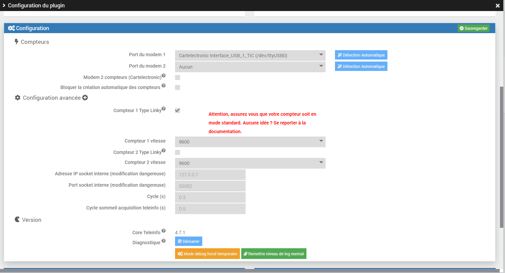

Présentation
===
Le plugin Téléinformation permet de récupérer les informations de votre compteur EDF et construire des statistiques de consommation et production.

**Attention**: à partir de la **version 4.7.3** du plugin il y a une nouvelle gestion des index (l'ancienne avec seulement BASE, HP et HC reste opérationnelle).

Pour plus de détail: [explications](/plugin-teleinfo/fr_FR/index/)

<br><br><br><br><br><br><br><br><br><br>


Architecture
===
Pour récupérer la Téléinformation il faut se connecter sur les bornes I1 et I2 du compteur :


<br>
<br>

## Compteur électronique


Pas de configuration spécifique pour ce type de compteur.

<br>
<br>

## Compteur Linky


Le compteur linky possède 2 modes de téléinformation 
>Pour connaitre le mode utilisé appuyer plusieurs fois sur le + de votre compteur linky jusqu'à l'affichage TIC Standard ou TIC Historique.

-    Mode historique : Ce mode assure une compatibilité égale aux compteurs d'ancienne génération.
     Pour configurer ce mode, aller dans les paramètres du plugin, cliquer sur le + (1), ne pas cocher 2 et si besoin sélectionner 1200 en 3 :
<br>
     

     
     
<br>
<br>

-    Mode standard : mode de communication plus récent, **seul ce mode requiert l'option Linky sur le plugin**.
     Pour configurer ce mode, aller dans les paramètres du plugin, cliquer sur le + (1), cocher 2 et si besoin sélectionner 9600 en 3 :
<br>
<br>


     
<br>
<br>
<br>
<br>
<br>

Cas d'utilisation de 2 compteurs
===


## Utilisation d'un second compteur
<br>

Si vous disposez de 2 compteurs chez vous, il faut le paramétrer (sauf si utilisation du modem ci dessous) :

<br>


<br>

<br>

## Utilisation du modem Cartelectronic 2 Compteurs
<br>

Dans le cas d'utilisation du modem Cartelectronic 2 Compteurs et le branchement de 2 compteurs électrique il est nécessaire d'activer le mode 2 compteurs.
<br>


Installation
===
Commencer par installer le plugin depuis le market : [https://doc.jeedom.com/fr_FR/core/3.3/plugin](https://doc.jeedom.com/fr_FR/core/3.3/plugin)

Après avoir activé le plugin vous devez choisir le port du modem :



En cas d'utilisation d'un modem série il est nécessaire de renseigner son port et d'ajouter ce port au groupe dialout.


Enfin pensez à sauvegarder.

Un nouveau Protocole est disponible dans Plugins => Protocole domotique => Téléinfo


Configuration
===

Par défaut le plugin offre la possibilité de créer automatiquement les compteurs associés aux commandes réceptionnées. Il permet aussi de définir certains paramètres. 

Pour cela démarrez le daemon, attendez que les premières trames arrivent puis rendez vous sur Plugin / Protocoles Domotiques / Téléinfo.
Vous devriez voir apparaitre un objet avec un ID.

Cliquez sur l'objet puis

Repère 1: cochez si vous voulez une création automatique des commandes, 

Repère 2: cochez si vous avez un Linky unique qui fonctionne en mode consommateur ET producteur,

Repère 3: cochez si votre abonnement est Heure creuse / heure pleine ou Tempo ou EJP. Les différents abonnements seront traités dans une future mise à jour.

enfin sauvegardez. A partir de ce moment toutes les commandes reçues et non reconnues seront ajoutées automatiquement et l'affichage du panel sera adapté à votre configuration.


Vous pouvez également créer votre appareil manuellement :
-   Créez votre nouvel appareil en cliquant sur Ajouter
-   Ajoutez les commandes que vous souhaitez récupérer en cliquant sur le bouton vert "Commande"
-   Vous pouvez également afficher des statistiques de consommation (Aujourd'hui / Hier / Mois en cours / Mois dernier) en cliquant sur le bouton "Ajouter une statistique"
-   Renseignez le nom affiché dans Jeedom, le Sous-Type en fonction de l'information qui sera récupérée, la donnée à récupérer et enfin les paramètres associés.
-   Cliquez sur sauvegarder.

>Il est possible de désactiver la création automatique des nouveaux compteurs:
>
>

>Il est possible aussi de désactiver la création automatique des nouvelles commandes en décochant:
>
>


Les commandes
===

Les commandes (Ajouter une donnée) correspondent aux données envoyées par la téléinformation via le modem à Jeedom.

Celles-ci dépendent du mode de fonctionnement de votre compteur.

Pour le mode historique :
-   Index (Base / Heures Pleines / Heures Creuses)
-   Index (Heures Normales / Heures de pointe mobile / Heures Pleines Bleu / Heures Creuses Bleu / Heures Pleine Blanc / Heures Creuses Blanc / Heures Pleines Rouge / Heures Creuses Rouge)
-   Tranche tarifaire
-   Type d'abonnement
-   Puissance instantanée
-   Intensité instantanée (Pour triphasé également)
-   Alerte dépassement (Pour triphasé également)
-   Intensité souscrite
-   Préavis EJP (30 minutes avant)
-   Couleur EJP lendemain.

Pour le mode Standard les principaux index sont:
- EAST: équivaut à 'BASE' dans le mode historique
- EASF01 à EASF10: index utilisés pour répartir les différents tarifs horaires, leur utilisation dépend de l'abonnement souscrit
- EAIT: puissance envoyée vers le réseau si vous êtes producteur


> résumé et comparaison entre les deux modes:

>  

> Pour consulter la liste complète: [Enedis-NOI-CPT_54E.pdf](../images/Enedis-NOI-CPT_54E.pdf)


Les statistiques
===

Afin d'obtenir des informations sur une durée plus longue des statistiques ont étés ajoutées.
Ces statistiques correspondent aux informations suivantes :
-   Consommation du jour en cours
-   Consommation d'hier
-   Puissance apparente : Certains compteurs ne renvoie pas l'information PAPP. Pour cela un calcul à été implémenté afin d'obtenir une moyenne de consommation en W toutes les minutes.

De plus certaines statistiques (consommation du mois, de l'année en cours, ...) sont affichées sur le panel

  
  
  
Le panel doit être validé dans la configuration du plugin

  
  

Les unités
===

-   Les index : Watt-heure
-   Tranche tarifaire : Chaîne de caractères.
-   Puissance apparente instantanée : Volt-Ampère.
-   Les intensités : Ampère.
-   Les alertes dépassement : Ampère
-   Type d'abonnement : Chaîne de caractères.
-   Le préavis EJP et la couleur du lendemain : Chaîne de caractères.
-   La conso moyenne sur la dernière minute : Watt


Les Index => ajout depuis la version 4.7.2
===
Si problème lors de la recopie des index => mettre tous les coûts à 0 et relancer la copie sur la période qui pose souci

à compléter


Santé
===
Il est possible de vérifier la réception des données avant traitement.

Pour cela rendez vous sur l'objet téléinfo puis cliquez sur Santé


La fenêtre qui s'ouvre permet de vérifier la bonne reception des données :


API
===
Le plugin téléinfo met à disposition une api afin de mettre à jour les données depuis d'autres systèmes.
Il s'agit d'une URL d'appel de type POST.

Pour y accéder ces informations sont obligatoires :

URL = http://#IP_JEEDOM#:#PORT_JEEDOM#/jeedom/plugins/teleinfo/core/php/jeeTeleinfo.php?apikey=#VOTRE_API_JEEDOM#

 #IP_JEEDOM# correspond à l'adresse ip de votre Jeedom

 #PORT_JEEDOM# correspond au port d'accès à votre Jeedom

 #VOTRE_API_JEEDOM# est la clé API disponible depuis Roue Cranté / Configuration

 

En paramètre du POST l'information device est obligatoire et correspond à l'identifiant du compteur.
```
{
"device": {
    "#IDENTIFIANT_DU_COMPTEUR#" : { "device":"#IDENTIFIANT_DU_COMPTEUR#", "#CLE#":"#VALEUR#", "#CLE#":"#VALEUR#" }
    }
}
```

Attention le /jeedom peux être différent si vous êtes sur une installation DIY ou OEM.

Par exemple pour l'index d'un abonnement BASE EDF équivalent à 123456789 :

    IP_JEEDOM : 192.168.1.15
    PORT_JEEDOM : 80
    VOTRE_API_JEEDOM : zertyuiolkjhgfdsxc
    IDENTIFIANT_DU_COMPTEUR : 0095123657
    Index BASE : 123456789

Donnera l'URL : http://192.168.1.15:80/jeedom/plugins/teleinfo/core/php/jeeTeleinfo.php?apikey=zertyuiolkjhgfdsxc
```
{
"device": {
    "0095123657" : { "device":"0095123657", "BASE":"123456789" }
    }
}
```

Il est possible d'envoyer toutes les informations transmises par les compteurs suivant les étiquettes définie par la norme.
Quelques unes (Les plus connues) :

	* BASE
	* HCHP
	* HCHC
	* PTEC
	* PAPP
	* IINST
	* ADPS


Diagnostic
===
Il est possible de lancer un diagnostique sur le plugin afin de tenter de détecter les problèmes.
Pour cela un bouton est mis à disposition sur la page configuration du plugin


La page de diagnostique propose plusieurs étapes à réaliser dans l'ordre.
Des conseils sont disponibles afin d'aider à la résolution.
Il est également possible de générer une archive contenant les infornations nécessaires à l'ouverture d'un ticket.


LOG
===
Plusieurs fichiers de logs sont mis à disposition par le plugin.

- teleinfo : Contient les informations receuillies par Jeedom
- teleinfo_update : Pour les mises à jours du plugins
- teleinfo_deamon_#type# : Contient les logs du démon.

Ils sont accessibles directement depuis la zone Log et Surveillance sur la page de configuration du plugin et la page Log Jeedom.

 


FAQ
===

>J'ai un modem Cartelectronic qui n'envoi aucune information

Plusieurs firmwares existent pour ce modem, seul le firmware linux est compatible avec Jeedom.
Pour le mettre à jour :

ATTENTION ! Je vous conseille de lire le forum en premier afin d'être sûr d'effectuer les bonnes actions. Je ne pourrais être tenu responsable des opérations effectuées.

Télécharger le programme et le firmware ici : [http://www.cartelectronic.fr/logiciels/Modif%20teleinfo%201TIC.zip](http://www.cartelectronic.fr/logiciels/Modif%20teleinfo%201TIC.zip)
(Pour le modem 1 compteur : [http://www.cartelectronic.fr/blog/?p=1125](http://www.cartelectronic.fr/blog/?p=1125))

- Installer le logiciel FT PROG
- exécuter FT PROG
- faire un scan (loupe) pour rechercher les modules USB
- une fois le module trouvé aller dans FILE -> OPEN TEMPLATE et sélectionner le fichier : Interface USB 1 TIC SF.xml
- cliquer sur le module détecté avec le bouton droit et sélectionner appliquer template
- cliquer sur le module détecté avec le bouton droit et sélectionner programmer
- A la fin le modem peux être débranché.

>Un second équipement c'est créé lors de la mise à jour

Un nouvel équipement peut apparaitre lorsque vous montez d'une version et que l'ancienne ne contenait pas l'ADCO du compteur.
Pour récupérer l'ancien équipement :
- Copier l'ADCO du nouvel objet dans celui de l'ancien.
- Sauvegarder l'ancien.
- Supprimer le nouveau.

>Success - No result has been sent s'affiche lorsque je clique sur Tester

Cela indique que la donnée n'a pas été reçu par le plugin.
Deux cas sont possible :
- La donnée n'existe pas sur votre abonnement.
- La donnée n'as pas encore eu le temps de remonter.

Dans tous les cas il est nécessaire d'attendre 24h après l'installation du plugin pour être sûr des données qui sont reçu.

>Les statistiques restent à zero

Il est nécessaire que l'historisation des index soit activée afin de que les statistiques se calcule.
Il est possible de forcer le calcul en relancant les 2 tâches suivantes depuis le moteur de tâche :
- CalculateTodayStats
- CalculateOtherStats

>J'ai une installation DIY et je ne récupère aucune information

Il est nécessaire dans certains cas de supprimer certaines lignes du fichier /boot/cmdline.txt

Supprimer :

    console=ttyAMA0,115200 kgdboc=ttyAMA0,115200

et commenter la ligne suivante dans le fichier  /etc/inittab

    #T0:23:respawn:/sbin/getty -L ttyAMA0 115200 vt100

Depuis la version jessie le fichier inittab n'est plus présent. Il faut utiliser ces lignes de commandes :

    sudo systemctl stop serial-getty@ttyAMA0.service
    sudo systemctl disable serial-getty@ttyAMA0.service

>Mon panel n'affiche pas les informations

Dans un premier temps cliquer sur le bouton vérifier en haut à droite du panel afin de connaître l'état des données.
Dans le cas ou une données est NOK aller sur l'objet téléinfo puis le re sauvegarder.

>Mes statistiques ne se mettent pas à jour / sont erronés

Afin que les statistiques soient calcullés il est nécessaire que les index soient historisés. Vérifier la bonne configuration de ceux-ci.
Le lissage des historiques Jeedom peut induire des valeurs statistiques erronées. Pour supprimer le lissage pour chaque index :

- Cliquer sur la petite roue à côté du bouton Tester (En mode expert)
- Aller sur l'onglet Configuration Avancée
- Dans la zone historique choisir Aucun pour le mode de lissage.
- Enregistrer

>Je souhaite déporter le démon de téléinformation

Dans certaine installation, il peut-être utile de déporter le daemon de téléinformation

Configuration de Jeedom
- Inutile d'installer les dépendances
- Désactivez la gestion automatique du Démon
- Allez dans la configuration du plugin et indiquer l'adresse IP du serveur hébergant le daemon dans le champ 'Adresse IP socket interne (modification dangereuse)'

Configuration de votre serveur hébergeant le démon
- Installez le démon
```
wget http://IP-JEEDOM/plugins/teleinfo/ressources/globals.py
wget http://IP-JEEDOM/plugins/teleinfo/ressources/teleinfo.py
mkdir jeedom
cd jeedom
wget http://IP-JEEDOM/plugins/teleinfo/ressources/jeedom/__init__.py
wget http://IP-JEEDOM/plugins/teleinfo/ressources/jeedom/jeedom.py
```
- Executez le démon en ajustant les paramètres (insérez le à votre script de démarrage)
```
python /root/teleinfo/teleinfo.py --port /dev/ttyUSB0 --apikey API-KEY-JEEDOM-TELEINFO --callback http://IP-JEEDOM/plugins/teleinfo/core/php/jeeTeleinfo.php --loglevel debug --cyclesommeil 15 --pidfile /tmp/teleinfo --sockethost IP-SERVEUR-DEMON >> /tmp/teleinfo.log 2>&1 &
```
- Remarque 1 : si vous observez des infos manquantes, surtout si vous avez un compteur en mode standard, n'hésitez pas à baisser la valeur de "--cyclesommeil 15", par défaut ce cycle de sommeil de téléinfo dans jeedom est de 0.5
- Remarque 2 : il peut-être nécéssaire d'installer des dépendances Python (inspirez-vous du fichier http://IP-JEEDOM/plugins/teleinfo/ressources/install_apt.sh)


Bug
===

En cas de bug sur le plugin il est possible de demander de l'aide :

[https://community.jeedom.com/tag/plugin-teleinfo](https://community.jeedom.com/tag/plugin-teleinfo)

ou d'ouvrir une issue :

[https://github.com/NextDom/plugin-teleinfo/issues](https://github.com/NextDom/plugin-teleinfo/issues)