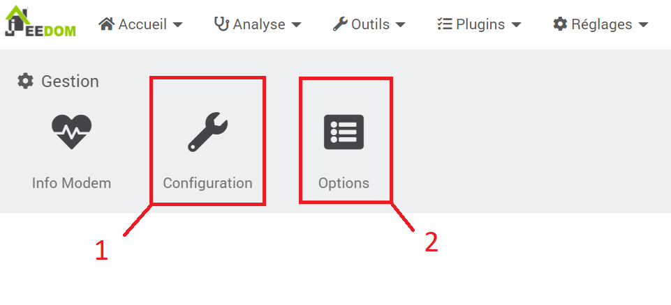
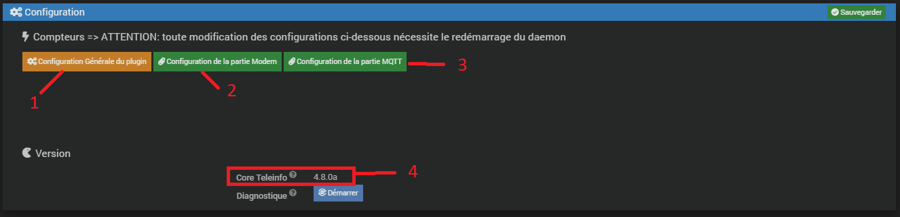
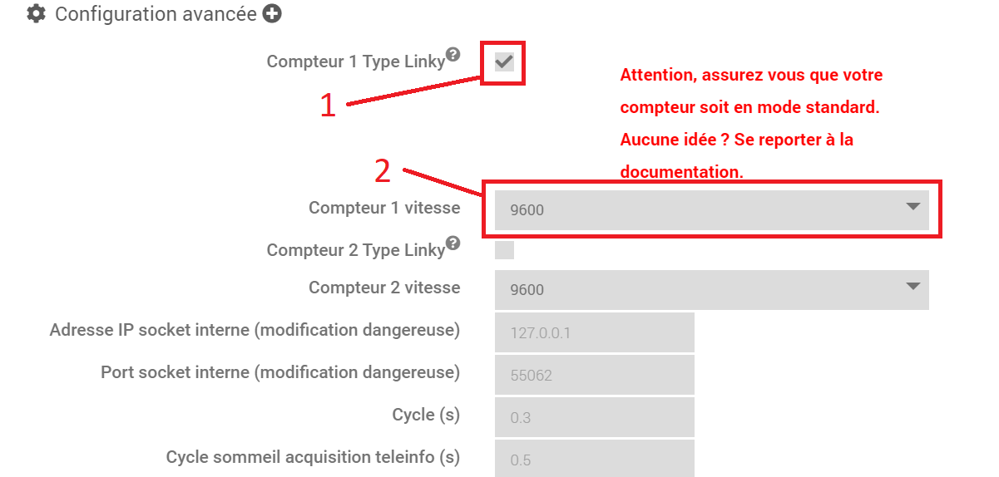
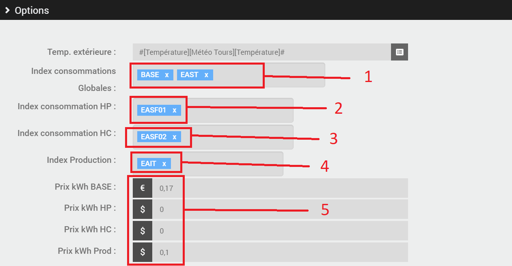
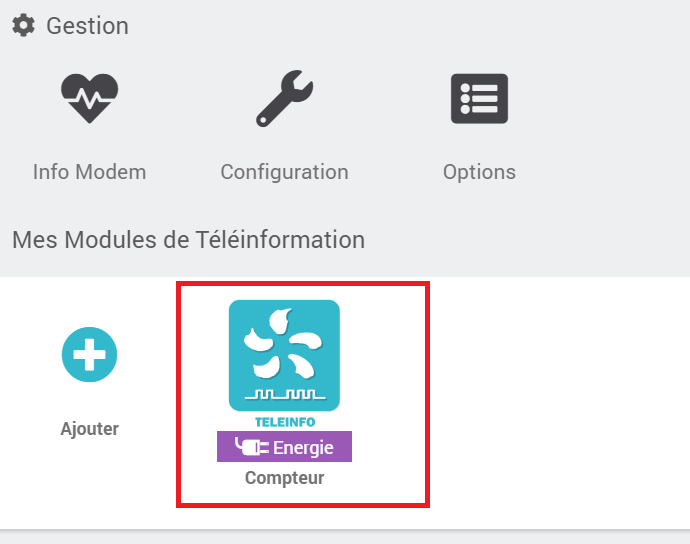

  

# Nouveautés
       
# Après l'installation

 
une fois le plugin installé Jeedom vous propose d'aller dans le panneau de configuration:
 

<a href="../../images/teleinfo_config01.png">

<a>
     

## configuration:
 

       

## Détection automatique:
 

Ne fonctionne pas à l'heure actuelle. Affiche systématiquement la TIC du compteur en mode historique.
 

Cette option a été dévalidée.
       

## Bloquer la création automatique des compteurs
 

Décocher cette case permet au plugin de créer un nouveau compteur en fonction de la trame TIC reçue.
Cette option n'est à décocher que si c'est votre première utilisation du plugin ou si vous changez de compteur ou encore si vous installez un nouveau compteur.
       

# Le Panel:
  

<a href="../../images/teleinformation_panel0.png">

<a>
  

Cocher cette case pour permettre l'affichage du panel que vous pourrez afficher via le menu:
 

<a href="../../images/teleinformation_panel1.png">

<a>
  
Le panel en lui même sera vu plus loin dans cette doc

           

# Configuration avancée:
 

Cliquer sur le + permet d'afficher les paramètres de configuration du modem
 

<a href="../../images/teleinfo_config03.png">

<a>
          

## Compteur type Linky:
 

Cette option permet de faire la différence entre le mode TIC historique ou standard. Le mode TIC peut être identifié pour un compteur Linky sur la cadran du compteur en appuyant plusieurs fois sur le + ou le -. Tous les autres compteurs sont en mode historique, seul le Linky peut avoir un mode standard.
Si vous avez un mode historique il ne faut pas cocher cette case
            

## Vitesse:
 

Si vous avez un mode historique la vitesse doit être fixée à 1200
Si vous avez un mode standard la vitesse doit être fixée à 9600
            

# Options:
 

<a href="../../images/teleinfo_options.png">

<a>
  
Ces options ne servent que pour l'affichage des statistiques dans le panel selon la même forme que dans les versions antérieures à la V 4.7.3
            

## Index conso globales (nouveau)
 
Permet d'indiquer au plugin quel est l'index qui sert à construire les statistiques de la consommation globale
            

## Index conso HP
 
Si vous avez un abonnement HP / HC
            

## Index conso HC
 
Si vous avez un abonnement HP / HC
            

## Index Production
 
Si vous avez un compteur qui sert aussi à comptabiliser la production que vous envoyez vers le réseau (option uniquement possible avec un linky en mode standard)
            

## Prix kWh
 
Sert à indiquer le tarif appliqué pour chaque index cité avant
            

# Le compteur
 
Si des trames TIC sont reçues par le plugin et que l'option de création automatique de nouveau compteur n'est pas bloquée alors celui ci va créer un nouveau compteur:
  
<a href="../../images/teleinfo_compteur02.png">

<a>
  
En cliquant dessus vous rentrez dans l'équipement
          

# L'équipement:
 
<a href="../../images/teleinfo_compteur02.png">

<a>
  

## Paramètres de base
 
rien de neuf
  

## Création des commandes
 
Autorise la création de nouvelles commandes reçues via le modem. Permet de créer automatiquement les commandes qui n'existaient pas avant ou qui auraient été effacées.
  

## Compteur en mode conso ET prod
 
Introduit avec la version 4.7.2, permet de suivre les statistiques d'un compteur servant à comptabiliser sa consommation et sa production. Production en autoconsommation par exemple. Cette possibilité n'existe que si vous avez un linky en mode standard.
  

## Abo HP / HC (ancienne méthode)
 
Si vous voulez continuer à suivre les statistiques dans le panel de votre compteur de la même façon qu'avant la V4.7.3 et que vous avez un abonnement qui incrémente les index HP et HC
  

## Utilisation des nouveaux index (nouveau)
  
Permet de suivre jusqu'à 10 index dans le panel paramètrables indépendamment les uns des autres + l'index 00 qui sert soit au suivi des conso pour un abonnement de base soit de totalisateur de l'ensembles des index de 01 à 10.
          

# [Retour à la documentation principale](/plugin-teleinfo/fr_FR/)
