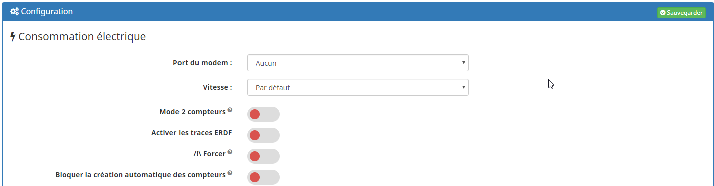
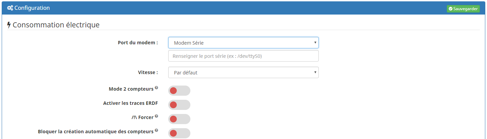

Installation
===
Commencer par installer le plugin depuis le market : [https://doc.jeedom.com/fr_FR/core/3.3/plugin](https://doc.jeedom.com/fr_FR/core/3.3/plugin)

Après avoir activé le plugin vous devez choisir le port du modem :

En cas d'utilisation d'un modem série il est nécessaire de renseigner son port et d'ajouter ce port au groupe dialout.

Enfin pensez à sauvegarder.

Un nouveau Protocole est disponible dans Plugins => Protocole domotique => Téléinfo