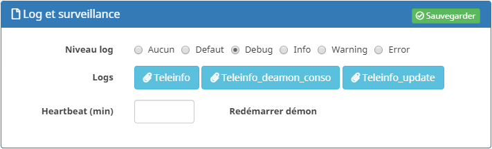

LOG
===
Plusieurs fichiers de logs sont mis à disposition par le plugin.

- teleinfo : Contient les informations receuillies par Jeedom
- teleinfo_update : Pour les mises à jours du plugins
- teleinfo_deamon_#type# : Contient les logs du démon.

Ils sont accessibles directement depuis la zone Log et Surveillance sur la page de configuration du plugin et la page Log Jeedom.

 
