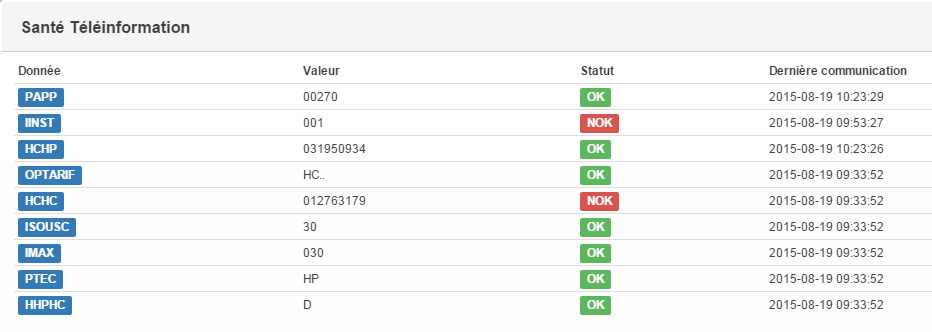

Santé
===
Il est possible de vérifier la réception des données avant traitement.

Pour cela rendez vous sur l'objet téléinfo puis cliquez sur Santé

La fenêtre qui s'ouvre permet de vérifier la bonne reception des données :

